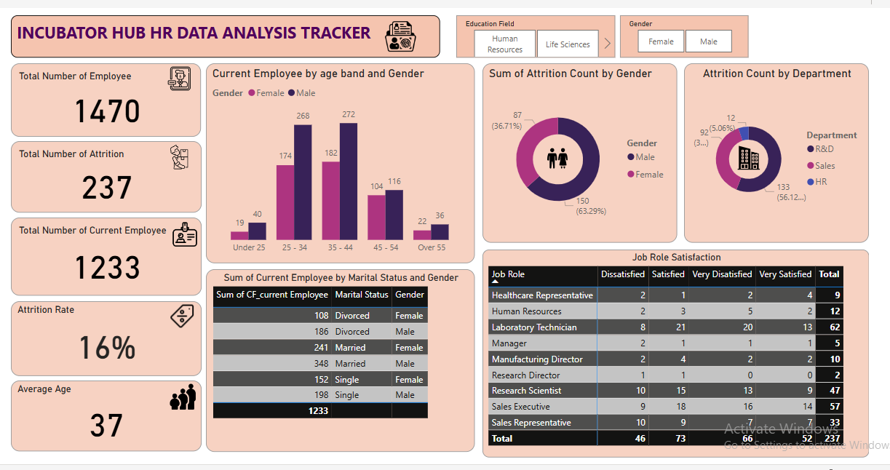
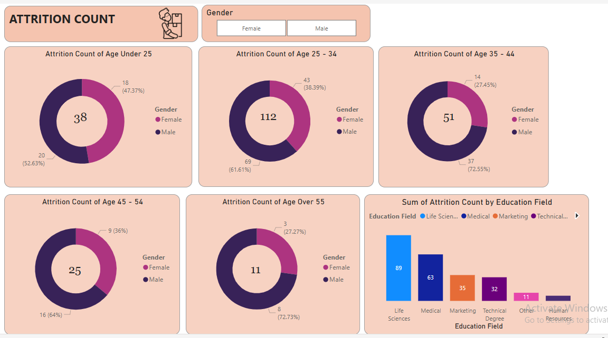

# HR-Attrition-Analysis


## Project Overview

This is a Power BI project on HR attrition for a Organization. The aim of the project is to analyze and derive insights to answer pivotal questions and help the organization make data driven decisions.

## Data Sources

The primary source of data is HR data .xlxs, made available by LITA Data Analysis Bootcamp by The Incubator hub.

## Data Collected

Data collected comprises of the following key columns needed for analysis:
1. Attrition: contains data for people who left organization or company
2. CF_age band: contains the age range of employees
3. Department: various department within the organization or company
4. Educational Field: various educational qualifications of employees
5. Gender: gender of employees
6. Job Role: various job description of employees
7. Marital Status
8. Age: Biological age of employees
9. CF_current employee: employees working currently
10. Job Satisfaction: Data on how satisfied employee are with their job.

## Problem Statement

1. What is the attrition rate?
2. Which gender has the highest attrition count?
3. Which  department has the highest attrition count?
4. What is the demographics of the current employees?
5. What is the job role satisfaction of employees who were part of the attrition?

 ## Key Metrics

- Attrition Rate
- Attrition by Age 
- Attrition by Gender
- Attrition by Job Role and 
- Attrition by Department.

## Data Cleaning and Preparations

At the initial phase the following actions were performed:
- Data loading and Inspection
- Handling missing variables
- Handling duplicate rows and columns
- Data cleaning and formatting

## Tools Used

Tool used for this project is Power BI, for DAX and data visualization

## Skills Demonstrated

The following Power BI features  were incorporated:
- DAX
- Quick Measures
- Filters

## Formula Used

The following Power BI features were incorporated. Dax and Quick measures, formulas used to achieve these are as follows:

```Power BI
Attrition Rate = SUM('HR data'[Attrition Count])/SUM('HR data'[Employee Count])

Average age = AVERAGE('HR data'[Age])

Table.AddColumn(#"Changed Type1", "Custom", each if [Attrition] = "Yes" then 1 else 0)

Table.AddColumn(#"Changed Type2", "Custom", each if [CF_age band] = "Under 25" then 1 else if [CF_age band] = "25 - 34" then 2 else if [CF_age band] = "35 - 44" then 3 else if [CF_age band] = "45 - 54" then 4 else 5)

Table.AddColumn(#"Changed Type3", "Job Sattisfaction Rate", each if [Job Satisfaction] = 1 then "Very Disatisfied" else if [Job Satisfaction] = 2 then "Dissatisfied" else if [Job Satisfaction] = 3 then "Satisfied" else "Very Satisfied")
```

## Data Visualization

The report comprises of 2 pages:
1. Current Employee Data
2. Sum of Attrition Count by Age

You can interact with the report [here](https://app.powerbi.com/view?r=eyJrIjoiMDAwNTdlMjQtYjljOC00YWIzLTgwZTItOGU3ODUyOWM4ZDljIiwidCI6IjUxMDUyMzkzLWY1ZjgtNDkwOS1hZWE4LTkyOWFhMjRhOGI0NyJ9
)

## Data Analysis

### 1. Current Employee Data and Attrition



Overall Observation
- Attrition Rate: the analysis showed that the total number of employees who were part of the attrition were 273 out of 1470 total employees and the attrition rate is (16%).
- Attrition by Gender: the males had the highest attrition count with a total number of 150(63.29%) employees being part of the attrition, while the total number of females who were part of the attrition are 87(36.71%).
- Attrition by Department: R&D department has the highest attrition count.
- Current Employee by Gender and Age band: the age band 35 - 44 constitute the highest percentage of the current employee with the male being 272 and females 182.
- Current Employee Marital Status and Gender: insights from the data revealed that the married people make up the large percentage of the current employee with the married males being 348 and a value of 241 for females.
- Attrition by Job Role Satisfaction: the data revealed that the laboratory technician constitutes the highest percentage of the employees who are part of the attrition with a total number of 62 employees, this is followed by the sales representatives with a total number of 57 employees leaving the organization. The data also showed that among the 67 laboratory technicians who left, 20 were very dissatisfied with their job role while 21 of them were satisfied.  Of the 57 sales representatives who left the organization, 16 people were very dissatisfied with their job roles while 18 of them were satisfied. Overall  73 out of the 273 employees who were part of the attrition were satisfied with their job role but they left anyway.

### 2. Sum of Attrition Count by Age Band and Gender



Overall Observation

The number of males who were part of the attrition are higher compared to the number of females.
- Attrition of  age under 25 shows that a total of 38 people who left the organization with males having a higher percentage.
- Attrition of age 25 - 34: 112 people under this age category were part of the attrition with males having a higher percentage, and this age category had a higher attrition count compared to the remaining. 
- Attrition of age 35 - 44:  51 people in this age range were part of the attrition with males having a higher percentage of people who left.
- Attrition of age 45 - 54: 25 people in this age range were part of the attrition and males alo had the highest percentage of people who left.
- Attrition of age over  55: 11 people in this age range were part of the attrition with males accounting for the higher percentage compared to females. This age range had the lowest number of the total number of people who left the organization and this can be due to old age and nearly reaching retirement.   
- Sum of Attrition Count by Educational Field: people who studied Life Sciences Made up the highest percentage of the total number of people who left the organization with a total value of 89 out 273 people who left the organization. This is followed by people who studied medicine or medical related courses (63), and people who studied marketing ( 35), then followed by the rest

## Conclusion 

- The attrition Rate of the organization was 16% and the average age of the employee was 37.
- The male employees had higher attrition rate across all the age groups compared to the females employees
- The majority of the employees that left were satisfied with their job role while the minority were dissatisfied
- The R and D department had the highest number of employees who departed while the HR department had the lowest.
- People who studied life sciences were the highest employees who left the organization while people who studied human resource were the lowest.

## Recommendation
- Exit interviews such as gathering feedback from departing employees  to identify patterns( like dissatisfaction with management, compensation or workload) should be conducted, this can help quantify common reasons for attrition. Changes such as improved work life balance policies and clearer career progression should be implemented based on recurring feedback.
- Analyzing compensation and benefits for the younger age groups who had the highest number of employees who departed  is very crucial as the reason they left may be due to insufficient benefits perceived by them. This can be done by comparing salary structures with industry benchmarks. Salaries should be adjusted and competitive offers such as healthcare, wellness programs and retirement plans should be included.
- Strengthen career development opportunities for employees who are not satisfied with their job role or educational field and would want to upskill, as the reasons they left may be due to perceived limited growth opportunity. Organization should invest in upskilling programs, mentorship and leadership training, and also offer a clear career progression path.


